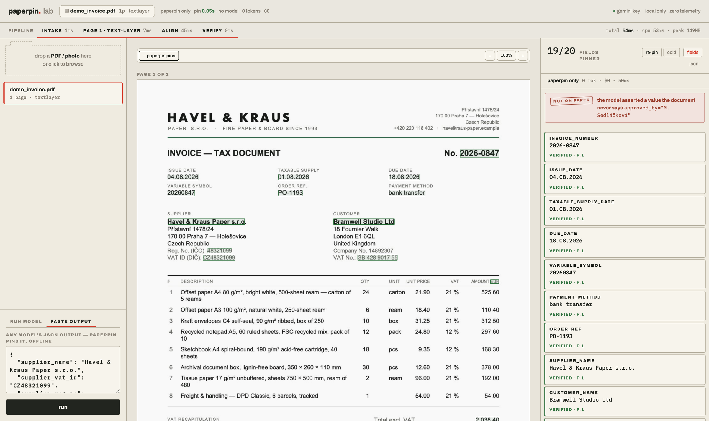
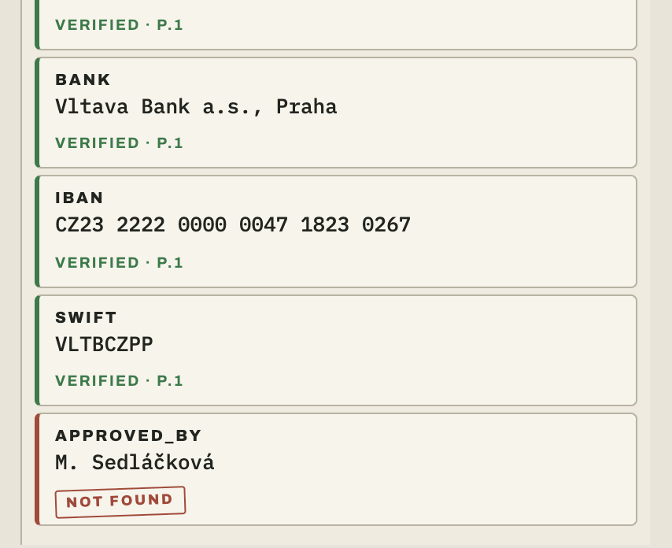
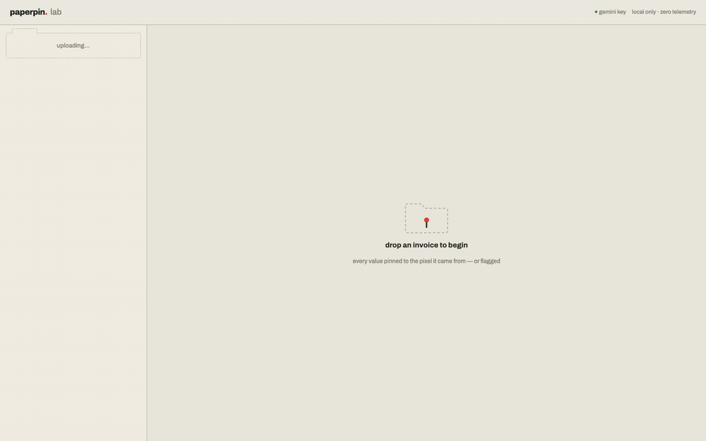

<div align="center">

# 📌 paperpin

**Pin every value an LLM extracts from a document to the exact spot on the page it came from, and flag the values that aren't there at all.**

[](https://pypi.org/project/paperpin/)
[](https://pypi.org/project/paperpin/)
[](LICENSE)



*One value was fabricated on purpose. paperpin caught it.*

</div>

---

Models read documents well and lie about coordinates badly. Ask an LLM where a value sits on the page and you get plausible boxes that drift, snap to the wrong line, or point at whitespace. The one value it hallucinated gets a confident box too.

paperpin never asks the model for coordinates. The model only reads; deterministic OCR / text-layer geometry locates; an alignment algorithm links the two; verification proves or flags every field:

- a box produced this way **cannot be hallucinated**: it exists only where document text actually matched;
- a value the model invented matches nothing and comes back **`not_found`, the hallucination flag**;
- everything else gets one of five honest statuses, never a silent guess.

| status | meaning |
|---|---|
| `verified` | located exactly; every verification check that ran agreed (checksum/arithmetic proof recorded in `proof` when one exists) |
| `low_confidence` | located, with doubt: a fuzzy match, or an exact match a verification check demoted. A human should glance |
| `ambiguous` | multiple equally plausible locations; all candidates in the JSON (overlay/viewer draw the pinned one) |
| `not_found` | the model asserted a value that matches nothing on the page. **The hallucination flag** |
| `not_present` | the model itself said the field isn't on the document |

<div align="center">

</div>

## Install

```bash
pip install "paperpin[full]"        # recommended: PDF + OCR + model adapters
# pip install paperpin              # core only: images + BYO-JSON, no PDF/OCR
```

## Use

```python
from paperpin import ground, extract

# ground ANY existing extraction: yours, Azure's, anyone's JSON
result = ground("invoice.pdf", extraction={"total": "146,14", "iban": "SK73..."})

# or extract + ground in one call. No schema needed, the model names the fields
result = extract("photo.jpg", model="gemini/gemini-2.5-flash")

result["total"].status    # "verified"
result["total"].bbox      # (x0, y0, x1, y1) normalized, on the ORIGINAL page
result["total"].evidence  # the exact document text it matched
result.overlay("proof.png"); result.viewer("proof.html")
```

No document types anywhere. With no schema the model names the fields itself and paperpin pins whatever it asserted; pass a field list (`schema="invoice"` or your own) only when you want guided recall.

Runnable examples live in [`examples/`](examples/): grounding any JSON offline, every schema knob, the full result surface with a triage pattern, the CLI, all tuning options, and calling paperpin from Node. Every parameter is documented right below in [Every knob](#every-knob).

Try the same flow visually:

```bash
pip install "paperpin[full,lab]"
paperpin lab
```

<div align="center">

</div>

The document in every screenshot is [synthetic](fixtures/demo/demo_invoice.py): a fictional company with a deliberately invalid registration number, because demos on real customer invoices are someone's real data. What the screenshots show is a real run, and [a test asserts it stays true](tests/test_demo_doc.py).

## Measured, not promised

On a private corpus of 847 real documents (invoices, bills, credit notes, delivery lists, proformas, contracts, statements across 7 countries; born-digital PDFs, scans, and phone photos, handwriting and crumpled paper included), the current engine grounds **6,830 model-asserted fields** like this:

| outcome | share |
|---|---|
| pinned to an exact page location (`verified` + `low_confidence`) | **87.8%** |
| `ambiguous`, all candidate locations returned | 1.4% |
| `not_found`, asserted by the model but not locatable on paper | 10.7% |

The number that matters is what it *refuses* to guess: every unpinned field says so out loud. The corpus is private (it is real people's paperwork, the reason this library exists); the grading method is deterministic and the synthetic fixture corpus in [`fixtures/corpus`](fixtures/corpus) runs the same gates at CI speed on every change.

## Why not just ask the model for boxes?

Because you cannot audit a guess with another guess. Text-grounding tools (Google's [LangExtract](https://github.com/google/langextract), 38k★) solved this for plain text by matching the model's output back to the source, and their own issue tracker shows [people asking for exactly this on documents](https://github.com/google/langextract/issues/184). Documents are harder: the "source" is pixels, OCR is noisy, layouts wrap and repeat. That geometry is the whole of what paperpin does:

1. **Intake**: PDF text layer when it's trustworthy, OCR when it isn't (RapidOCR, CPU-only).
2. **Align**: the model's value strings are matched against located document text: exact, normalized (dates, amounts, IBANs), then fuzzy, with per-field-type rules.
3. **Verify**: checksums (IBAN/VAT), arithmetic (totals), format checks promote or demote every match; disagreement is a status, never a silent pick.

- **CPU-only.** Runs on a slow laptop. No GPU, no cloud, fully offline in BYO-JSON mode.
- **Any model.** `gemini/…`, `openai/…`, `openrouter/…`, `deepseek/…`, `ollama/…`, any OpenAI-compatible endpoint. Or no model at all: bring the JSON you already have.
- **Background-friendly.** `PAPERPIN_OCR_THREADS=1` pins OCR to one core; combine with `nice -n 19` and grounding runs invisibly.
- **Zero telemetry.** Nothing phones home. API keys go only to the provider you chose. The OCR cache lives in `~/.paperpin/cache/`, local only.

## Honest limits

- Model calls send at most 12 pages (`meta["pages_truncated"]` tells you when more existed); multi-frame images decode at most 50 pages.
- Dense handwriting is the hardest corpus slice. Statuses stay honest about it (`not_found` rather than a wrong box), but recall drops.
- Rotated pages are handled per-page; mixed-orientation rescue is on the roadmap.
- Table cell geometry on 500+ item documents gets slow (quadratic matching; a fix is scoped).


## Every knob

The complete surface. Nothing exists beyond what is listed here.

## `ground(source, extraction, schema=None, backend="auto", use_cache=True, progress=None)`

Pin an existing extraction to the document. Offline, no model involved.

| param | type | meaning |
|---|---|---|
| `source` | str / Path | PDF or image (jpg, png, webp, tiff, heic/heif). Multi-frame images decode up to 50 frames |
| `extraction` | dict / JSON str / path | the values to ground. Lists of row objects are grounded per cell and flattened to `name[i].col` |
| `schema` | None / `"invoice"` / `"receipt"` / path / dict | optional field specs, see Schemas below. None = types inferred from names and values |
| `backend` | `"auto"` | OCR backend for pages without a usable text layer. `"auto"` = RapidOCR (CPU). PDF text layers never touch OCR |
| `use_cache` | bool | OCR text cache in `~/.paperpin/cache/`, local only. Re-runs on the same file are instant |
| `progress` | callable | `fn(stage, phase, info)` called around each pipeline stage; exceptions in it never break a run |

Returns a `GroundResult`.

### `extract(source, schema=None, model="byo", prompt=None, extraction=None, backend="auto", use_cache=True, api_key=None, base_url=None, timeout=180.0, progress=None)`

Model read + grounding in one call.

| param | meaning |
|---|---|
| `model` | `"gemini/…"`, `"openai/…"` (bare `gpt-…` works), `"openrouter/…"`, `"deepseek/…"`, `"ollama/…"`, or `"byo"` (default) which requires `extraction=` and behaves like `ground()` |
| `schema` | None (default) = schema-free: the model names the fields itself. A schema means guided recall: the model is asked for exactly those fields |
| `prompt` | extra steering appended to the extraction request ("dates exactly as printed") |
| `api_key` | overrides the provider env var (`GEMINI_API_KEY`, `OPENAI_API_KEY`, …) |
| `base_url` | any OpenAI-compatible endpoint (Ollama, vLLM, LM Studio) via `model="openai/<name>"` |
| `timeout` | seconds per model call, default 180 |

Model calls send at most 12 pages; `result.meta["pages_truncated"]` says
how many were dropped when more existed.

### `GroundResult`

Mapping-style container: `result["total"]`, `in`, `len`, `iter`,
`.keys() / .items() / .get()`, `.fields` (plain dict).

| member | meaning |
|---|---|
| `.counts()` | `{"verified": 9, "not_found": 1, ...}` |
| `.pages` | list of `PageInfo`: `.index`, `.width`, `.height` (original space: pixels for images, points for PDF), `.route` (`"textlayer"` / `"ocr"`), `.dpi`, `.px_width`, `.px_height` |
| `.meta` | run metadata: `adapter`, `backend`, `ground_seconds`, and for model runs `extract_seconds`, `token_usage`, `pages_truncated` |
| `.source` | the input path |
| `.save(path)` | versioned JSON, written atomically |
| `.to_json(indent=1)` | the same JSON as a string, for piping or POSTing |
| `GroundResult.from_dict(json)` | rebuild from `save()` output; unknown keys ignored |
| `.page_image(page=0, width=None)` | PIL image of the page a bbox is normalized against — multiply a bbox by its `(width, height)` for pixels |
| `.overlay(path, page=None)` | PNG of the page(s) with status-colored boxes |
| `.viewer(path)` | self-contained interactive HTML viewer |

### `FieldResult`

| attr | meaning |
|---|---|
| `.status` | `verified` / `low_confidence` / `ambiguous` / `not_found` / `not_present` (enum; `.value` is the string) |
| `.page` | 0-based page index |
| `.bbox` | `(x0, y0, x1, y1)` normalized 0..1, origin top-left, on the upright ORIGINAL page (EXIF orientation already applied). Multiply by `pages[page].width/height` for pixels |
| `.evidence` | the exact document text that matched |
| `.proof` | `"checksum"` or `"arithmetic"` when a verification proved the value, else None |
| `.candidates` | for `ambiguous`: every tied location as `Candidate(.page, .bbox)` |

### Schemas

A schema is a dict of `field_name -> spec` (or a preset name, or a path
to a JSON file with the same shape). Every spec key is optional:

| key | values | buys you |
|---|---|---|
| `type` | `text` `number` `date` `id` `percent` `block` `table` | type-aware normalization and matching (dates in any print format, numbers with any separators, token-set matching for multi-line `block` values) |
| `anchors` | list of label words | tie-breaking toward the printed label ("invoice", "no.") when a value appears twice |
| `checksum` | `"iban"` `"ean"` `"vat"` | checksum-valid match is recorded as `proof="checksum"`; invalid candidates are demoted |
| `proof` | `{"sum": [f, ...]}` / `{"product": [f, ...]}` / `{"percent_of": [base, rate]}` | arithmetic across sibling fields recorded as `proof="arithmetic"`; disagreement demotes |
| `columns` | dict of specs | `table` only: per-cell specs for row objects |
| `aliases` | `{"EUR": ["€"]}` | the document may print an alternate literal for the value; matching any alias grounds the field |
| `pattern` | regex | `id` fields: a page print full-matching the pattern can rescue OCR-garbled ids sharing the same core |
| `affinity` | list of field names | prefer the line where those fields pinned (a currency mark beside its total) |

Presets shipping today: `invoice`, `receipt`.

### CLI

```
paperpin ground  FILE --extraction JSON [--schema S] [--backend B]
                 [--no-cache] [-o result.json|-] [--quiet]
                 [--overlay proof.png] [--view proof.html]
paperpin extract FILE [--model M] [--schema S] [--prompt P]
                 [--extraction JSON] [--backend B] [--no-cache]
                 [-o result.json|-] [--quiet] [--overlay] [--view]
paperpin overlay FILE result.json [-o proof.png] [--page N]   # N is 0-based
paperpin view    FILE result.json [-o proof.html]
paperpin pages   FILE [-o dir] [--width N] [--page N] [--format png|jpg]
paperpin lab     [--port 8377] [--no-browser]
paperpin version
```

`paperpin pages` writes the page rasters a viewer needs; boxes are
normalized, so any `--width` renders them correctly.

`-o -` writes the result JSON to stdout and moves the summary to stderr, so
`paperpin ground doc.pdf --extraction e.json -o - | jq` pipes cleanly from any
language; `--quiet` drops the summary entirely.

The CLI loads a local `.env` before running; as a library, export the
provider variable yourself or pass `api_key=`.

### Environment

| var | effect |
|---|---|
| `PAPERPIN_OCR_THREADS=1` | pin OCR to one core (about 2x slower, machine stays responsive; pair with `nice -n 19`) |
| `GEMINI_API_KEY`, `OPENAI_API_KEY`, `OPENROUTER_API_KEY`, `DEEPSEEK_API_KEY` | adapter keys |
| `PAPERPIN_LAB_TOKEN` | fixes the Lab's per-start auth token (dev convenience) |

### Output JSON shape

The shape is a contract other languages read, so it is written down as JSON
Schema in [`docs/result.schema.json`](docs/result.schema.json) and every
release is validated against it. `paperpin.schema` is the version of the
*shape* — branch on that, not on `paperpin.version`, which moves every
release. `meta` keys vary by run: tolerate ones you do not know.

`save()` / `-o` writes:

```jsonc
{
  "paperpin": { "version": "0.1.0", "schema": 1,
                "coordinate_space": "normalized 0..1, origin top-left, upright original page" },
  "source": "invoice.pdf",
  "pages":  [ { "index": 0, "width": 595.3, "height": 841.9, "route": "textlayer" } ],
  "fields": { "total_due": { "status": "verified", "page": 0,
                             "bbox": [0.68, 0.62, 0.9, 0.64],
                             "evidence": "2 424.54", "proof": "arithmetic",
                             "candidates": [] } },
  "summary": { "verified": 9, "not_found": 1 },
  "meta":    { "adapter": "byo", "backend": "textlayer", "ground_seconds": 0.05 }
}
```

## Contributing

Issues are very welcome, especially documents where a status lied. See [CONTRIBUTING.md](CONTRIBUTING.md) for how to run the two test gates; PRs are best opened after an issue. Security reports: [SECURITY.md](SECURITY.md).

MIT © [Rjabov](https://github.com/Rjabov)
